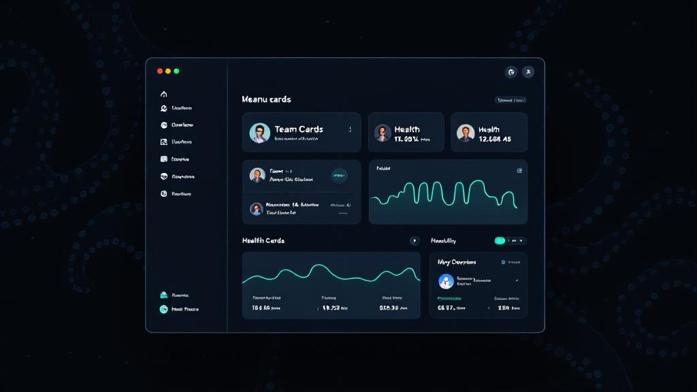

<p align="center">
  
  
  
  
  
</p>

<h1 align="center">InkPulse</h1>
<p align="center"><strong>The missing control plane for Claude Code.</strong><br>Monitor, organize, and orchestrate AI agent teams from your macOS menu bar.</p>

<p align="center">
  <em>One developer. Multiple agents. Full visibility.</em>
</p>

<p align="center"></p>

---

## The Problem

Claude Code runs one session per terminal. Power users running **8-15 sessions** across multiple projects hit a wall:

- **No team structure** — a flat list of terminals with no logical grouping
- **No orchestration** — can't spawn or coordinate sessions from one place
- **No visibility** — cost, token usage, and anomalies are invisible
- **Cognitive overload** — tab-switching across 15 terminals kills focus

InkPulse gives you a **bird's-eye view** of everything your AI agents are doing — and lets you control them.

## What It Does

### Team Org Chart
Group sessions into teams with named roles. Each team maps to a project directory.

```
Backend Team [~/projects/my-api]
  PM         — roadmap, priorities
  Dev        — code, deploy, debug
  Reviewer   — code review, quality

Frontend Team [~/projects/web-app]
  Designer   — UI/UX implementation
  Dev        — components, state
  Tester     — e2e, accessibility
```

### One-Click Spawn
Click **Spawn** on any team — InkPulse opens Terminal windows for each role with the correct working directory and role prompt injected. Agents start working immediately.

### Real-Time Health Monitoring
8 metrics per session, computed with sliding windows:

| Metric | What it measures |
|--------|-----------------|
| **tok/min** | Token throughput (60s window) |
| **Cache hit** | Cache read vs total input ratio |
| **Error rate** | Failed tool calls (5min window) |
| **Cost** | Running session cost |
| **Context %** | Context window utilization |
| **Subagents** | Spawned agent count |
| **Think:Output** | Reasoning vs output ratio |
| **Idle gaps** | Pause time between events |

### Anomaly Detection
**AnomalyWatcher** catches problems before they burn your credits:

- **Hemorrhage** — cost increasing too fast
- **Explosion** — token output out of scale
- **Loop** — repetitive tool call patterns

Native macOS notifications with sound alerts. Cooldown logic prevents alert fatigue.

### Smart Project Inference
When working from `~/`, InkPulse analyzes file paths in tool calls to infer the **actual project** you're working on. No manual tagging required.

### Daily Cost Budget
Set a daily spending limit. Progress bar in the UI. Alert when you're close to the cap. **The AI that regulates its own spending.**

### WebSocket Control Channel
Bidirectional communication on `localhost:9998`. Send tasks to specific agents programmatically. Build your own automation on top.

## Quick Start

```bash
git clone https://github.com/mattiacalastri/InkPulse.git
cd InkPulse
swift build -c release
```

### Install to Applications

```bash
cp -rf .build/release/InkPulse.app /Applications/
open /Applications/InkPulse.app
```

### Requirements

- macOS 14.0 Sonoma or later
- Claude Code installed
- Swift 5.9+ (Xcode 15+)

## Configuration

### Teams (`~/.inkpulse/teams.json`)

```json
{
  "teams": [
    {
      "id": "backend",
      "name": "Backend",
      "cwd": "~/projects/my-api",
      "color": "#00d4aa",
      "roles": [
        {
          "id": "pm",
          "name": "PM",
          "prompt": "You are the Project Manager. Read CLAUDE.md, prioritize tasks.",
          "icon": "chart.bar.fill"
        },
        {
          "id": "dev",
          "name": "Dev",
          "prompt": "You are the Lead Developer. Implement features and fix bugs.",
          "icon": "hammer.fill"
        },
        {
          "id": "reviewer",
          "name": "Reviewer",
          "prompt": "You are the Code Reviewer. Review PRs and suggest improvements.",
          "icon": "magnifyingglass"
        }
      ]
    }
  ]
}
```

### Settings (`~/.inkpulse/config.json`)

Override refresh rate, session timeout, health score weights, daily budget alerts, and pillar color mappings.

## Architecture

```
InkPulse.app — pure Swift, zero external dependencies

┌─────────────────────────────────────────────────────┐
│  UI Layer (SwiftUI)          Control Layer           │
│  ├── Team Org Chart          ├── WebSocket :9998     │
│  ├── Role Cards              ├── Session Registry    │
│  ├── Spawn Buttons           ├── Command Dispatch    │
│  ├── Live/Trends/Reports     └── Status Receive      │
│  └── Daily Cost Budget                               │
│                                                      │
│  Intelligence Layer          Notification Layer       │
│  ├── JSONL File Tailer       ├── EventDetector       │
│  ├── MetricsEngine (8 KPI)   ├── AnomalyWatcher      │
│  ├── Health + EGI Score      └── macOS Notifications  │
│  └── Project Inference                               │
└─────────────────────────────────────────────────────┘
```

**Read-only** — InkPulse never modifies your Claude Code files or sessions.

## How It Works

1. Watches `~/.claude/projects/` for JSONL session logs
2. Parses events in real-time, computes health metrics with sliding windows
3. Matches sessions to team roles by working directory
4. Displays live org chart in menu bar popover + full dashboard
5. Spawn opens Terminal.app windows with `claude "<role prompt>"`
6. WebSocket server enables external automation

## Roadmap

- [x] Team org chart with collapsible sections
- [x] One-click spawn with role prompts
- [x] WebSocket control channel
- [x] Smart event notifications + anomaly detection
- [x] Daily cost budget with alerts
- [x] Project inference from file paths
- [x] Session kill with confirmation
- [ ] MCP Hub — shared MCP server pool across agents
- [ ] Send Task UI — dispatch prompts to agents from dashboard
- [ ] macOS widget for daily cost
- [ ] Cross-session data export

## Why InkPulse?

| | Without InkPulse | With InkPulse |
|---|---|---|
| **Visibility** | Check each terminal manually | One dashboard, all agents |
| **Cost control** | Surprise bills | Daily budget + anomaly alerts |
| **Organization** | Flat terminal list | Teams with roles and prompts |
| **Spawning** | Open terminal, cd, type prompt | One click |
| **Problems** | Notice when it's too late | Real-time anomaly detection |

## Contributing

Contributions are welcome. Check out the [open issues](https://github.com/mattiacalastri/InkPulse/issues) for things to work on.

```bash
git clone https://github.com/mattiacalastri/InkPulse.git
cd InkPulse
swift build
swift test
```

## License

Apache 2.0

## Author

Built by [Mattia Calastri](https://github.com/mattiacalastri) with Claude Code.

Part of the [Astra Digital](https://digitalastra.it) ecosystem.
