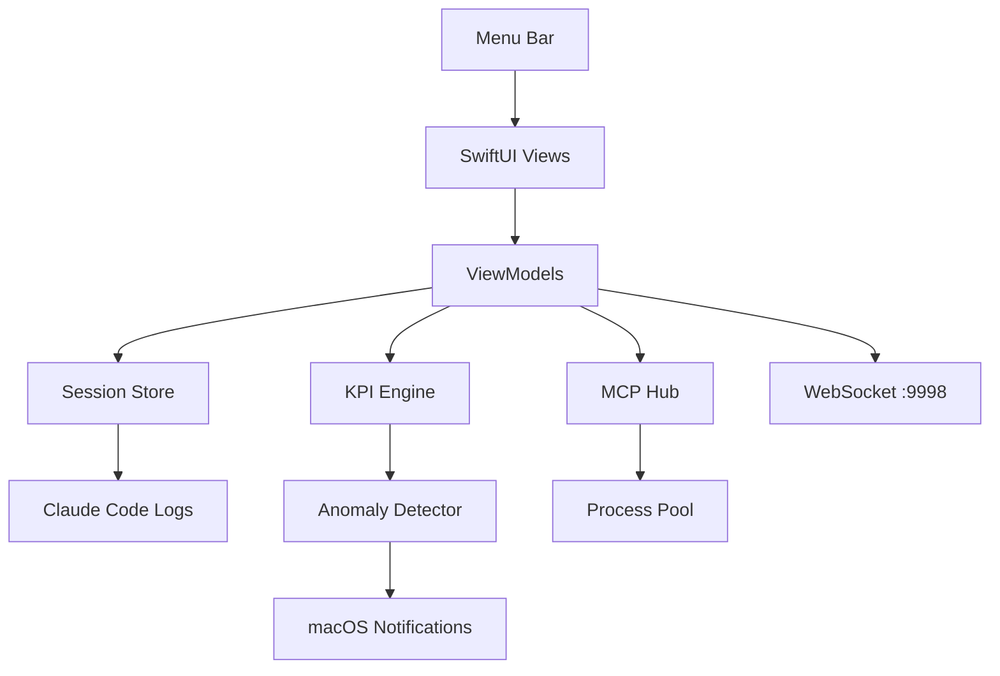

<!--
SEO Keywords: claude code, anthropic, ai agents, orchestration, macos, menubar, swiftui,
swift, mcp, developer tools, control plane, multi-agent, cost monitoring, anomaly detection,
italian ai, astra digital, polpo squad
SEO Description: The missing control plane for Claude Code. Monitor, organize, and orchestrate AI agent teams from your macOS menu bar. 11K lines of Swift. Zero dependencies.
Author: Mattia Calastri
Location: Verona, Italy
-->

<div align="center">

# 🐙 InkPulse

### The missing control plane for Claude Code.

Monitor, organize, and orchestrate AI agent teams from your macOS menu bar.
**11K lines of Swift. Zero dependencies.**

[](./LICENSE)
[](https://github.com/mattiacalastri/InkPulse/stargazers)
[](https://github.com/mattiacalastri/InkPulse/issues)
[](https://swift.org)
[](https://www.apple.com/macos/)
[](#)
[](https://mattiacalastri.com)

</div>

---

## ✨ Why

Managing concurrent Claude Code sessions today means:

- Tab-switching across 15 terminals with no logical grouping
- No way to spawn or coordinate sessions from one place
- Cost and token usage invisible until the bill arrives
- Anomalies (runaway loops, exploding context) go unnoticed
- N sessions × M MCP servers = dozens of duplicated processes

**InkPulse replaces that chaos with a single control plane.**

## 🎯 Features

- 🐙 **Team Org Chart** — Group sessions into named teams and roles, not a flat terminal list
- ⚡ **One-Click Spawn** — Launch an entire agent team with correct directories and role prompts
- 📊 **8 KPI Metrics** — tok/min, cache hit ratio, error rate, cost, context %, subagent count, think:output ratio, idle gaps
- 🚨 **Anomaly Detection** — Hemorrhage, explosion, and loop alerts before they burn your credits
- 🔌 **MCP Hub** — Shared MCP server pool across all sessions (N agents, 1 set of processes)
- 💰 **Cost Governance** — Daily budget with progress bar and threshold alerts
- 🔗 **WebSocket Control** — Bidirectional channel on `localhost:9998` for programmatic automation
- 🧠 **Smart Inference** — Auto-detects which project a session is working on from file paths

## 🚀 Quick Start

```bash
git clone https://github.com/mattiacalastri/InkPulse.git
cd InkPulse && swift build -c release
open .build/release/InkPulse.app
```

Requires macOS 13+ and Swift 5.9+ (Xcode 15+).

## 📖 What It Does

Claude Code runs one session per terminal. Power users running 8–15 sessions across multiple projects hit a wall: no grouping, no orchestration, no visibility into cost or anomalies.

InkPulse sits in your menu bar and gives you a bird's-eye view of everything your AI agents are doing.

| Layer | What it provides |
|-------|-----------------|
| **Team Org Chart** | Group sessions into teams with named roles (PM, Dev, Reviewer). Each team maps to a project directory. Collapsible sections, team-level aggregate stats. |
| **One-Click Spawn** | Click Spawn on any team — InkPulse opens Terminal windows for each role with the correct working directory and role prompt injected. Agents start working immediately. |
| **8 KPI Metrics** | Real-time health monitoring per session using sliding windows: token throughput, cache efficiency, error rate, running cost, context utilization, subagent count, reasoning ratio, idle time. |
| **Anomaly Detection** | Catches cost hemorrhage, token explosion, and tool-call loops. Native macOS notifications with cooldown logic to prevent alert fatigue. |
| **MCP Hub** | Shared MCP server pool. Instead of N sessions × M servers = N·M processes, InkPulse proxies all tool calls through a single set of server instances. |
| **Cost Governance** | Set a daily spending limit. Progress bar in the UI. Alert near the cap. The AI that regulates its own spending. |

Architecture is read-only — InkPulse never modifies your Claude Code files or sessions.

## 🏗️ Architecture



## ⚙️ Configuration

Define your teams in `~/.inkpulse/teams.json`:

```json
{
  "teams": [
    {
      "id": "backend",
      "name": "Backend",
      "cwd": "~/projects/my-api",
      "color": "#00d4aa",
      "roles": [
        { "id": "pm", "name": "PM", "prompt": "You are the Project Manager...", "icon": "chart.bar.fill" },
        { "id": "dev", "name": "Dev", "prompt": "You are the Lead Developer...", "icon": "hammer.fill" },
        { "id": "reviewer", "name": "Reviewer", "prompt": "You are the Code Reviewer...", "icon": "magnifyingglass" }
      ]
    }
  ]
}
```

## 🛠️ Built With

Pure Apple frameworks. No SPM dependencies. No CocoaPods. No Carthage.


- **SwiftUI** — all UI
- **Network** — WebSocket server
- **Combine** — reactive data flow
- **AppKit** — menu bar, notifications, Terminal.app integration

## 🗺️ Roadmap

- [ ] Send Task UI — dispatch prompts to agents from dashboard
- [ ] macOS widget for daily cost
- [ ] Cross-session data export
- [ ] iTerm2 / Warp terminal support

## 🤝 Contributing

Contributions welcome. See [open issues](https://github.com/mattiacalastri/InkPulse/issues).

```bash
git clone https://github.com/mattiacalastri/InkPulse.git
cd InkPulse && swift build && swift test
```

## 📄 License

[Apache 2.0](LICENSE)

## 🔗 Links

- 🌐 [mattiacalastri.com](https://mattiacalastri.com) · [digitalastra.it](https://digitalastra.it)
- 🐙 [Polpo Cockpit](https://github.com/mattiacalastri/polpo-cockpit) — the ~600-line sibling for single-project orchestration
- 🔨 [AI Forging Kit](https://github.com/mattiacalastri/AI-Forging-Kit) — the method behind the agents
- 🎙️ [Jarvis STT](https://github.com/mattiacalastri/jarvis-stt) — voice dictation for Claude Code

---

<div align="center">

**Built with 🐙 by [Mattia Calastri](https://mattiacalastri.com) · [Astra Digital Marketing](https://digitalastra.it)**

*AI for humans, not for hype*

</div>
