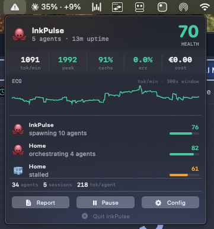
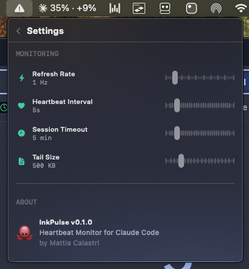

# InkPulse

**Heartbeat monitor for Claude Code** — a native macOS menu bar app that tracks AI agent health in real-time.

CodexBar tells you how much you spent. InkPulse tells you the **rhythm**.

   

<p align="center">
  
</p>

## What it does

InkPulse reads Claude Code's session JSONL files and computes 8 health metrics with sliding windows. A pulsating heart in your menu bar changes color based on agent health.

**8 metrics tracked in real-time:**

| Metric | What it measures |
|--------|-----------------|
| tok/min | Token throughput (60s rolling window) |
| Tool freq | Tool calls per minute |
| Cache hit | Cache read vs total input ratio |
| Error rate | Failed tool calls / total (5min window) |
| Think:Output | Thinking vs output token ratio |
| Subagents | Active spawned agents |
| Cost | Running session cost in EUR |
| Idle gaps | Average pause between events |

**5 anomaly patterns detected:**

| Pattern | Meaning |
|---------|---------|
| Stall | Agent blocked or waiting for permission |
| Loop | Retrying something that keeps failing |
| Hemorrhage | High cost + low cache = context rebuilding |
| Explosion | Too many subagents spawned |
| Deep Thinking | High think ratio + high throughput = good (blue, not red) |

## Features

- Native macOS menu bar widget (SwiftUI MenuBarExtra)
- Pulsating heart icon — color reflects health (teal/orange/red/blue)
- Multi-session monitoring (works with claude-squad)
- Per-agent emoji mood (thinking, forging, sleeping, stalled, spawning...)
- Project names from working directory (not UUIDs)
- Stats strip: tok/min, peak, cache%, error%, cost
- ECG sparkline showing token flow over time
- Native SwiftUI settings panel
- Heartbeat JSONL logging (daily rotation, 30-day retention)
- Chart.js HTML report generation
- Crash recovery via offset checkpoints
- Zero network calls — everything stays local

## Installation

### Build from source

```bash
git clone https://github.com/mattiacalastri/InkPulse.git
cd InkPulse
swift build -c release
```

### Run

```bash
.build/release/InkPulse
```

A heart icon appears in your menu bar. Click it to see the dashboard.

### Requirements

- macOS 14.0 Sonoma or later
- Claude Code installed (`~/.claude/projects/` must exist)
- Swift 5.9+ (comes with Xcode 15+)

## How it works

```
~/.claude/projects/*/*.jsonl  →  SessionWatcher (polling 1s)
                                      ↓
                                 JSONLParser (line → typed event)
                                      ↓
                                 MetricsEngine (8 metrics + sliding windows)
                                      ↓
                              ┌───────┼───────┐
                              ↓       ↓       ↓
                         Menu Bar  Heartbeat  Report
                         (SwiftUI)  (JSONL)   (HTML)
```

InkPulse watches `~/.claude/projects/` for recently modified JSONL files, tails new lines, parses events, and computes metrics. It **never modifies** Claude Code files — read-only.

## Data

All data stays local:

```
~/.inkpulse/
├── heartbeats/          # Daily JSONL snapshots (every 5s)
│   └── heartbeat-2026-03-23.jsonl
├── reports/             # Generated HTML reports
│   └── report-abc123-2026-03-23.html
└── offsets.json         # Crash recovery checkpoints
```

## Configuration

Click **Config** in the popover for a native settings panel:

<p align="center">
  
</p>

- **Refresh Rate** — How often metrics update (0.5-5 Hz)
- **Heartbeat Interval** — How often snapshots are logged (1-30s)
- **Session Timeout** — When to consider a session inactive (1-30 min)
- **Tail Size** — How much of each JSONL to read on startup (100-2000 KB)

## Health Score

Composite score 0-100 computed as a weighted average of individual metric scores:

| Metric | Weight | Healthy | Degraded | Critical |
|--------|--------|---------|----------|----------|
| tok/min | 15% | >500 | 100-500 | <100 |
| Tool freq | 15% | ~5/min (bell curve) | 0 or >12 | >17 |
| Cache hit | 15% | >60% | 30-60% | <30% |
| Error rate | 15% | <5% | 5-20% | >20% |
| Idle gaps | 10% | <15s | 15-60s | >60s |
| Think:Out | 10% | 1:1-4:1 | 4:1-8:1 | >8:1 |
| Subagents | 10% | 0-5 | 6-10 | >10 |
| Cost | 10% | <2 EUR | 2-8 EUR | >8 EUR |

## License

MIT

## Author

Built by [Mattia Calastri](https://github.com/mattiacalastri) with Claude Code.

Part of the [Astra OS](https://astraai.it) ecosystem — building observable, self-aware AI agent infrastructure.
